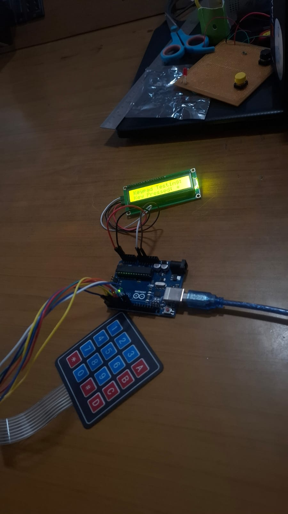

# KEYPAD AND LCD INTERFACE

# 1\. Product Description

This project is an Arduino-based Keypad and LCD Interface System designed to receive user input through a 4×4 matrix keypad and display the corresponding information on a 16×2 LCD.

# 2\. Product Use

Used for keypad input testing.

Displays the pressed key on the LCD.

Provides a simple user interface for embedded systems.

Can be used as a base for password and access-control systems.

# 3\. Components Used

Arduino UNO

4×4 Matrix Keypad

16×2 LCD Display

Jumper Wires

USB Cable

Breadboard

# 4\. How We Made It

We connected the 4×4 matrix keypad and 16×2 LCD display to the Arduino UNO using jumper wires. The required libraries were installed in Arduino IDE, and the Arduino was programmed to initialize the keypad and LCD. The LCD was configured to display “Keypad Testing” and “Press any key”, while the keypad was connected to detect user inputs.

# 5\. Working

When the user presses a key on the 4×4 keypad, the Arduino detects the pressed key and processes the input. The corresponding key information is then displayed on the 16×2 LCD, allowing us to verify that the keypad is working correctly.

# 6\. Software Used

Arduino IDE was used to write, compile, and upload the program to the Arduino UNO. The Keypad and LiquidCrystal libraries were used for interfacing.

# 7\. Applications

This system can be used in password-based security systems, digital control panels, access-control systems, calculators, menu-based interfaces, and other embedded applications.

# 8\. Advantages

Simple and low-cost system

Easy to build and test

Provides real-time user input

Easy to modify for different applications

Helps understand Arduino interfacing

# 9\. Conclusion

This project demonstrates the basic interfacing of an Arduino UNO with a 4×4 keypad and 16×2 LCD. It successfully detects keypad inputs and displays them on the LCD, providing a foundation for developing more advanced Arduino-based control and security systems. 

